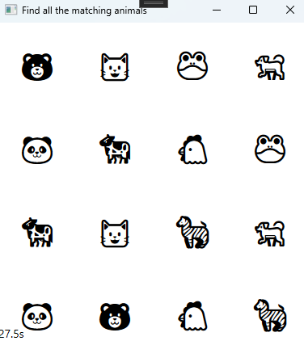
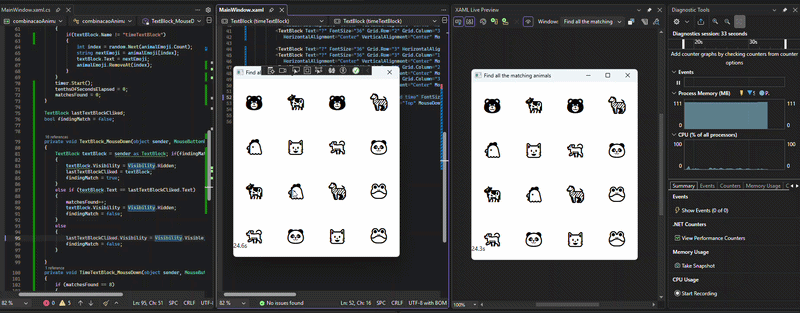

# CombinacaoAnimal 🐾



`combinacaoAnimal` é um jogo simples e divertido de memória desenvolvido usando **WPF e C#**. O objetivo é encontrar todos os pares correspondentes de emojis de animais em uma grade 4x4 no menor tempo possível.

---

## 🎮 Demonstração



---

## 🧩 Como Jogar

1. O tabuleiro do jogo consiste em uma grade 4x4, com cada célula escondendo um emoji de animal.
2. Clique em qualquer célula para revelar o emoji escondido.
3. Clique em uma segunda célula para encontrar o par correspondente.
4. Se os dois emojis forem iguais, eles serão removidos do tabuleiro.
5. Se não forem iguais, eles serão escondidos novamente.
6. Continue esse processo até encontrar todos os 8 pares de animais.
7. Um cronômetro na parte inferior da janela registra o tempo decorrido.
8. Após vencer, você pode clicar no texto do cronômetro para jogar novamente.

---

## ✨ Funcionalidades

- 🟦 **Grade interativa:** Uma grade 4x4 com um total de 16 cartas (8 pares).
- 🔀 **Tabuleiro aleatório:** Os emojis são embaralhados a cada partida.
- ⏱️ **Cronômetro:** Registra o tempo até o jogador vencer.
- 🔄 **Reinício rápido:** Possibilidade de jogar novamente facilmente.
  
---

## 🚀 Como Executar o Projeto

Para executar este projeto localmente, você precisará do **Visual Studio** e do **.NET SDK** instalados.

### 1. Clone o repositório

```bash
git clone https://github.com/MeirelesRodrigo/combinacaoAnimal.git
```

### 2. Navegue até o diretório do projeto

```bash
cd combinacaoAnimal
```

### 3. Abra a solução

Abra o arquivo `combinacaoAnimal.slnx` no Visual Studio.

### 4. Execute a aplicação

Pressione `F5` ou clique em **Start** no Visual Studio.

---

## 🛠️ Tecnologias utilizadas

- C#
- WPF (.NET)
- Visual Studio

---

## 📁 Estrutura recomendada

```
combinacaoAnimal/
│
├── images/
│   ├── screenshot.png
│   ├── demo.gif
│   ├── board.png
│   ├── gameplay.png
│   └── win.png
│
├── combinacaoAnimal.slnx
└── README.md
```

---

## 👨‍💻 Autor

Desenvolvido por **Rodrigo Meireles**
